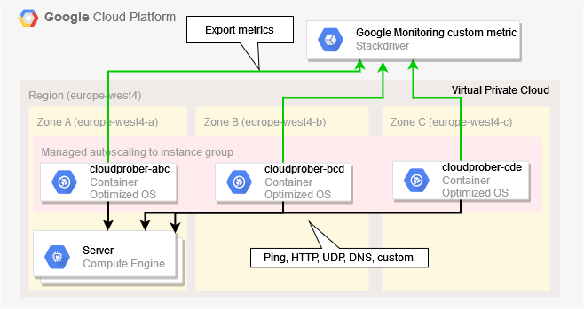

# Google Compute Engine Cloudprober

Monitor your Virtual Private Cloud with private subnets on Google Cloud Platform.
Check availability and performance of various internal components via [Cloudprober](https://cloudprober.org/).

* ✅ Check availability via ping
* ✅ Check UDP connections
* ✅ Check HTTP(s) availability
* ✅ Check DNS records

With the scripts in this repo,
you can quickly and easily build a robust and trusted monitoring infrastructure based on Google Compute Engine Container-Optimized Instances.

Google Monitoring with Cloudprober design:



## Setup

You need a Bash shell and the [Google Cloud SDK](https://cloud.google.com/sdk/docs/install).
You can also use your [Cloud Shell](https://cloud.google.com/shell/docs/using-cloud-shell).

Clone:
```shell
git clone https://github.com/Cyclenerd/gce-cloudprober.git
cd gce-cloudprober
```

### Config

View default Cloudprober server configuration file `default_config.sh`:
```shell
cat "default_config.sh"
```

Create configuration file `my_config.sh` and overwrite default values:
```shell
# Create custom configuration file and overwrite default
# Change project ID
echo "MY_GCP_PROJECT='my-project-id'" >> "my_config.sh"
# Change region
echo "MY_GCP_REGION='europe-north1'" >> "my_config.sh"
```

Create Cloudprober probe configuration file `cloudprober_config.cfg`:
```shell
cp "default_cloudprober_config.cfg" "cloudprober_config.cfg"
```

Edit configuration file `cloudprober_config.cfg`.
This configuration file is used by the Cloudprober software:
```shell
vi "cloudprober_config.cfg"
```

More help: <https://cloudprober.org/getting-started/#configuration>

💡 Tip: Check configuration file localy before you deploy it:
```shell
./cloudprober -configtest -config_file "cloudprober_config.cfg"
```

## Deploy Cloudprober monitoring servers

Deploy internal monitoring servers:

1. Create service account
1. Create health check
1. Create instance template
1. Create instance group
1. Set auto scaling

```shell
bash 01_deploy.sh
```

## List instances

List instances present in the managed instance group:

```shell
bash 02_list_instances.sh
```

## Update monitoring servers

If you want to roll out a change in the configuration file `cloudprober_config.cfg` or just want to update the used Docker image.

Create new template and activate new template for instance group:
```shell
bash 10_update_template.sh
```

With the following script you can update the instances.
They will then be redeployed one by one with the current template:
```shell
bash 11_update_instances.sh
```

## Contributing

Have a patch that will benefit this project?
Awesome! Follow these steps to have it accepted.

1. Please read [how to contribute](CONTRIBUTING.md).
1. Fork this Git repository and make your changes.
1. Create a Pull Request.
1. Incorporate review feedback to your changes.
1. Accepted!


## License

All files in this repository are under the [Apache License, Version 2.0](LICENSE) unless noted otherwise.